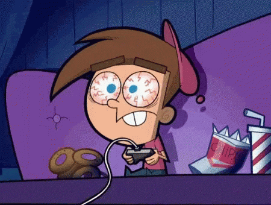

## **Gamers Asylum**
#### _Every Gamers new favorite safe space_

#### Written by ***Nicholas Emmons***
#### Published By ***Gamers Asylum***
#### Created on July 7, 2023
***
***

#### [**GitHub**](https://github.com/nemmons27/Gamers_Asylum)
#### [**Trello Board**](https://trello.com/b/20Wf3b0N/gamers-asylum)

***
***
### _**Description**_
Everyone experiences exhaustion but its all mental in some cases. I know I wasn't the only person punching the air because of Malenia in **Elden Ring**. We all just need a place to just woosah and put down the controller.

Thats what the ***Gamers Asylum*** is here for. In the Asylum, We leave *reviews* on *games* to see if anyone else out there is having a similar problem with a boss or a puzzle. Thats when our *comments* section comes in on our *reviews*. You could end find a party for a raid or a gaming guru to tell you a shortcut. Whatever it takes to go from Tweaking Timmy to just tired Goku.

***
***
### _**Technologies**_
+ MongoDb
+ Express.js
+ React
+ Node.js
+ JWT
+ S3/AWS
***
***
### _**Erd**_

***
***
### _**Component Hierachy**_

***
***

## _**PROJECT FLOW**_

- **FRIDAY**
    - [X] Project Conceptualization   
    - [X] Outline MODELS     
    - [X] Trello Board   
    - [] Component Hierachy   
    - [X] ERD   
    - [] ReadME   
- **SATURDAY**
    -
    -
    -
    -
- **SUNDAY**
    -
    -
    -
    -
- **MONDAY**
    -
    -
    -
    -
- **TUESDAY**
    -
    -
    -
    -
- **WEDNESDAY**
    - [] Final checks
    - [] Deployment
***
***

## _**Credits**_
#### **Images Used**
#### Strawhats Together -- [Icegif](https://www.icegif.com/one-piece-43/)
#### Tweaking Timmy -- [Tenor](https://tenor.com/view/gamer-cant-sleep-focused-sleep-is-for-the-weak-gif-11368894)
#### Tired Goku -- [Bo](https://boo.world/u/anime/EQOloZ/my-body-is-exhausted)
